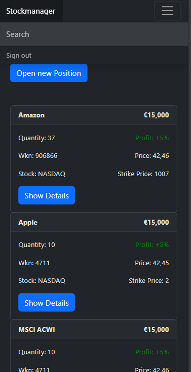

# Stockmanager

This is a simple example of a Stock Management App to experiment and maybe demonstrate aspects and benefits around Domain Driven Design,
[progressive enhancement](https://www.gov.uk/service-manual/making-software/progressive-enhancement).

The idea is to have a fast tech stack for domain specific apps, so that developers and users benefits from the a fast development approach.
I will try to follow the concepts around [ROCA](https://roca-style.org) and [Self Contained Systems](https://scs-architecture.org).

You can find mor idears and concepts in the Issues.



## Run application

To run the application with mavem, just execute the following command:

```mvn spring-boot:run```

By calling the URL http://localhost:8080/ you get the initial Dashboard of the UI.

The OpenAPI Definition can be found here: http://localhost:8080/swagger-ui/index.html

