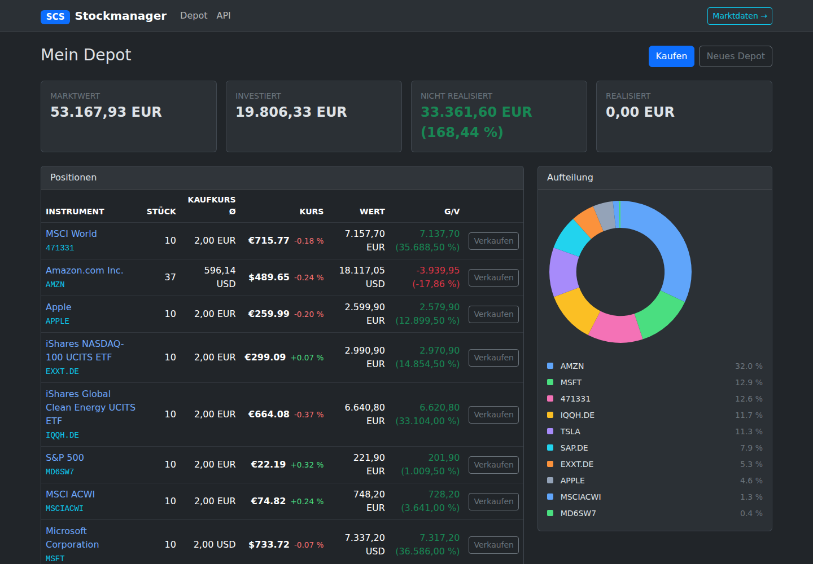
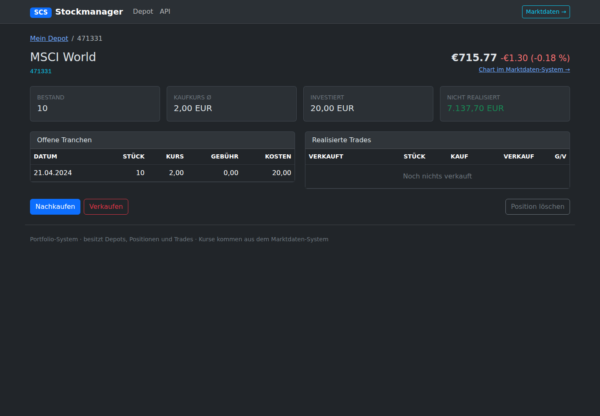
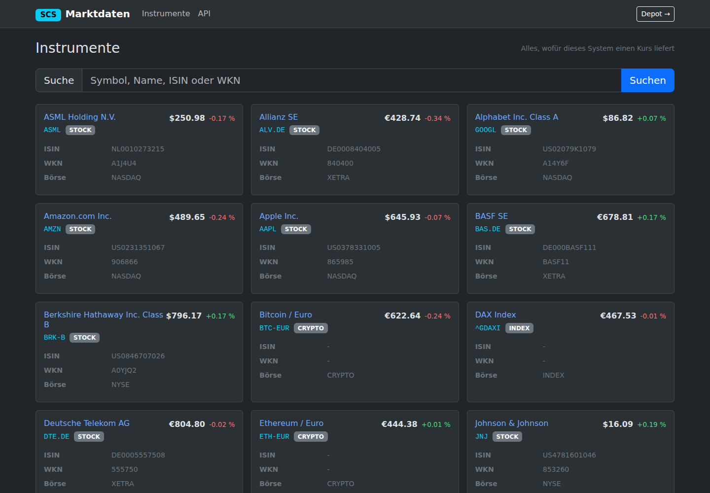

# Stockmanager

Ein Portfolio-Manager mit Live-Kursen, gebaut als zwei **Self-Contained Systems**, jedes für sich
nach **Domain-Driven Design** und **hexagonaler Architektur** geschnitten.



## Was man damit macht

* Depots anlegen und Positionen kaufen und verkaufen – mit Tranchen, Gebühren und Bruchstücken
* Verkäufe laufen nach **FIFO**: die ältesten Tranchen zuerst, realisierter Gewinn inklusive
* **Live-Kurse** je Instrument, per Server-Sent Events in die Seite geschoben
* Bewertung in der Depotwährung, Fremdwährungspositionen über den Devisenkurs umgerechnet
* Instrumentensuche über Symbol, Name, ISIN und WKN
* Kursverlauf mit Chart, Depotaufteilung als Donut
* REST-API mit OpenAPI-Dokumentation für beide Systeme

Die `positions.json` der Vorgängerversion wird beim ersten Start automatisch importiert.

| Position mit Tranchen und Trades | Instrumente des Marktdaten-Systems |
|---|---|
|  |  |

## Die zwei Systeme

| System | Port | Besitzt | UI |
|---|---|---|---|
| `scs-portfolio` | 8080 | Depots, Positionen, Tranchen, Trades | Depotübersicht, Kauf/Verkauf, Positionsdetails |
| `scs-marketdata` | 8081 | Instrumente, Kurse, Kurshistorie | Instrumentensuche, Chart, Kurs-Widget |

Sie teilen sich **nichts** außer dem Netzwerk: eigene Datenbank, eigenes Deployment, eigener
Release-Zyklus, sogar eigene Kopien gemeinsamer Wertobjekte wie `Money`. Integriert wird auf zwei
Wegen:

* **Server zu Server** – das Portfolio-System fragt Kurse über die HTTP-API des Marktdaten-Systems ab
  (`MarketDataPort` → `MarketDataRestAdapter`). Ist das andere System nicht erreichbar, bleibt das
  Depot lesbar und buchbar, die Positionen sind dann nur "ohne Kurs".
* **Im Browser** – die Depotseiten laden das Web Component `<market-quote>` von
  `http://localhost:8081/js/market-quote.js` und hängen an dessen Event-Stream. Wie ein Kurs
  aussieht, entscheidet also das System, dem er gehört. Klassische UI-Integration per
  Client-side Transclusion.

```
Browser ──── HTML ────────────────► Portfolio (8080) ──── HTTP /api/quotes ───► Marktdaten (8081)
   └──────── <market-quote> + SSE ───────────────────────────────────────────────────┘
```

Mehr zum Schnitt und den Entscheidungen dahinter: [doc/architecture.md](./doc/architecture.md).

## Architektur je System

Vier Maven-Module pro System, die Abhängigkeiten zeigen ausschließlich nach innen:

```
domain          Aggregate, Entities, Value Objects, Domain Services, Repository-Ports.
                Reines Java, kein Spring, kein JPA, kein Jackson.
application     Use Cases und ihre Ports: port.in (treibend), port.out (getrieben).
                Ebenfalls frameworkfrei – verdrahtet wird in bootstrap.
infrastructure  Adapter: Web (Thymeleaf + REST + SSE), Persistenz (JPA/Flyway),
                Kurs-Feeds, HTTP-Client zum anderen System. Templates gehören dem Web-Adapter.
bootstrap       Die lauffähige Anwendung: Spring Boot, Konfiguration, Verdrahtung.
```

Dass diese Regeln gelten, prüft `HexagonalArchitectureTest` mit ArchUnit bei jedem Build – inklusive
"das Domänenmodell kennt kein Framework", "kein System greift in den Code des anderen" und den
jMolecules-DDD-Regeln.

### Wichtige Domänenbegriffe

* **Portfolio** (Aggregate Root) – hält je Instrument höchstens eine Position, kennt seine Währung
* **Position** (Entity) – offene Tranchen und abgeschlossene Trades eines Instruments
* **Tranche** (Value Object) – ein Kauf: Stückzahl, Kurs, Gebühr, Handelstag
* **RealizedTrade** (Value Object) – ein abgeschlossener Round Trip mit realisiertem Gewinn
* **Money**, **Quantity**, **Symbol**, **Isin** (mit Prüfziffer), **Wkn** – Wertobjekte, die
  ungültige Zustände gar nicht erst zulassen

## Starten

### Mit Docker Compose

```bash
docker compose up --build
```

Depot: <http://localhost:8080> · Marktdaten: <http://localhost:8081>

### Mit Maven

Zwei Terminals, das Marktdaten-System zuerst:

```bash
mvn -pl scs-marketdata/bootstrap -am spring-boot:run
mvn -pl scs-portfolio/bootstrap  -am spring-boot:run
```

Beide Systeme starten mit einer eingebetteten H2-Datei-Datenbank unter `./data`. Für PostgreSQL:
`--spring.profiles.active=postgres` und die `*_DB_URL`-Variablen setzen.

## Kursquellen

`marketdata.provider` entscheidet, woher die Kurse kommen:

| Wert | Was es tut |
|---|---|
| `simulated` (Standard) | erfindet plausible Kurse – läuft ohne Internet und ohne API-Key |
| `yahoo` | Yahoo Finance, keine Anmeldung nötig, aber ein Gefälligkeitsdienst |
| `alphavantage` | Alpha Vantage, braucht `ALPHA_VANTAGE_API_KEY` (Free Tier ist hart limitiert) |

```bash
MARKETDATA_PROVIDER=yahoo docker compose up
```

Ein API-Key gehört in die Umgebung, nicht in die Konfigurationsdatei.

## API

* Depot: <http://localhost:8080/swagger-ui.html>
* Marktdaten: <http://localhost:8081/swagger-ui.html>

```bash
# Kurse
curl "http://localhost:8081/api/quotes?symbols=AAPL,SAP.DE"
curl -N "http://localhost:8081/api/quotes/stream?symbols=AAPL"   # live

# Depot
curl http://localhost:8080/api/portfolios
curl -X POST http://localhost:8080/api/portfolios/{id}/buy \
     -H 'Content-Type: application/json' \
     -d '{"symbol":"SAP.DE","quantity":10,"pricePerShare":190.50,"fee":1.90,"tradeDate":"2026-01-15"}'
```

## Technik

Java 25 · Spring Boot 4.1 · Thymeleaf mit Layout-Dialect · htmx · Bootstrap 5 · Spring Data JPA ·
Flyway · H2 bzw. PostgreSQL · Caffeine · jMolecules · ArchUnit · JUnit 5 mit AssertJ.

Die Oberfläche folgt [ROCA](https://roca-style.org) und
[Progressive Enhancement](https://www.gov.uk/service-manual/making-software/progressive-enhancement):
Jede Seite wird serverseitig gerendert und funktioniert ohne JavaScript; die Live-Kurse sind eine
Verbesserung obendrauf, kein Fundament. Charts sind handgezeichnet auf einem Canvas, damit keine
fremde Herkunft im CSP steht.

## Tests

```bash
mvn verify
```

Das umfasst Domänentests ohne Framework, Use-Case-Tests gegen In-Memory-Ports, Adaptertests gegen
H2 und einen gemockten HTTP-Server, Web-Tests gegen die echten Templates, die ArchUnit-Regeln und je
System einen Start des ganzen Kontexts – beim Portfolio-System bewusst mit unerreichbarem
Marktdaten-System, weil genau das der interessante Fall ist.
